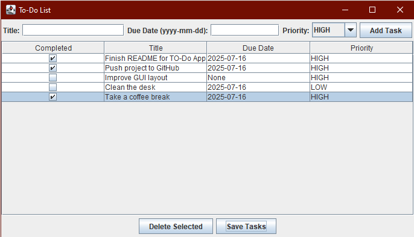

# 📝 Java To-Do List GUI APP
A sleek and simple To-Do List built using Java Swing. 

## Features 
- ✅ Add/view/complete/delete tasks 
- 📅 Due dates + priorities 
- 🖥️ Styled GUI using Java Swing 
- 💾 Tasks saved locally 

## Run Instructions 
javac toDoPac/*.java` 
java toDoPac.ToDoGUI`

## 📷 Screenshot 
Here’s what the app looks like in action: 

 
